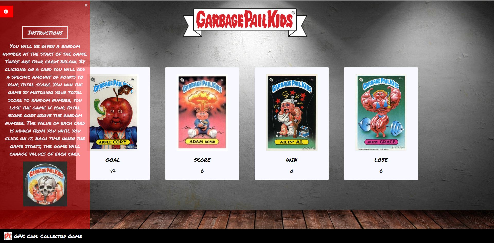

  

## Overview
This is a game themed on the 1980's collector cards, Garbage Pail Kids!
Here's how the game works:
There will be four cards displayed as buttons on the page.
You will be shown a random number at the start of the game.
When you click on a card, it will add a specific amount of points to the your total score. 
The cards value will be hidden until you click a card.
When a card is clicked, your score counter will be updated.

You win if your total score matches the random number from the beginning of the game.
You lose if your score goes above the random number.

A new Goal Value will be presented at the beginning of every round and each image will be given a new value as well.

A new round will start when you win or lose. The game will re-start when you reach six wins or loses, whichever comes first. The Win and Lose Counters will reset.

## Link to App
["Start Collecting!"](https://dustinmcgilvray.github.io/unit-4-game/)

## Crafted With
* HTML5
* CSS3
* JavaScript
* jQuery

## Acknowledgements
Hat Tip to Mark Hinton and his Tutorial on Building a Slide-Out Navigation Menu! 
[Video Tutorial](https://youtu.be/xVYrz61IBpQ)

## Authors
* Dustin McGilvray
